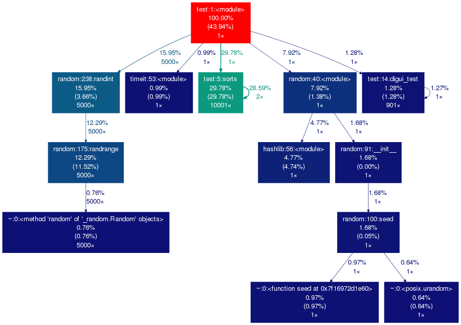

[](https://travis-ci.org/campos-ddc/cprofile_graph)
[](https://pypi.python.org/pypi/cprofile_graph)

# About cprofile_graph

cprofile_graph is used to generate visual graphs for Python profiling.

## Installation

* First you need to install Graphviz, use `sudo apt-get install graphviz graphviz-dev` in Ubuntu or see [this link](http://www.graphviz.org/Download.php) for other platforms.
* Use pip to install `cprofile_graph`.

```bash
pip install cprofile_graph
```

## Usage

* As a context manager:

```python
from cprofile_graph import profile_ctx
with profile_ctx("myprofile.png"):
    foo()
```

* As a function wrapper:

```python
@profile_decorator
def foo():
    1 + 1

@profile_decorator("myprofile.png")
def foo():
    1 + 1
```

* As a function:

```python
from cprofile_graph import profile_code
profile_code("foo()", "myprofile.png")
```

* As a script:

```bash
cprofile_graph myscript.py -o myprofile.png
cprofile_graph -c "foo()" -o myprofile.png
```

## Example

This is the kind of output you will get from cprofile_graph, hot colors indicate most used functions:



# Requirements

  * [gprof2dot](https://github.com/jrfonseca/gprof2dot): Convert cProfile stats into dot files.
  * [Graphviz](http://www.graphviz.org/Download.php): Convert dot files into visual graphs.
  * [pygraphviz](http://pygraphviz.github.io/): Call Graphviz from within Python.
